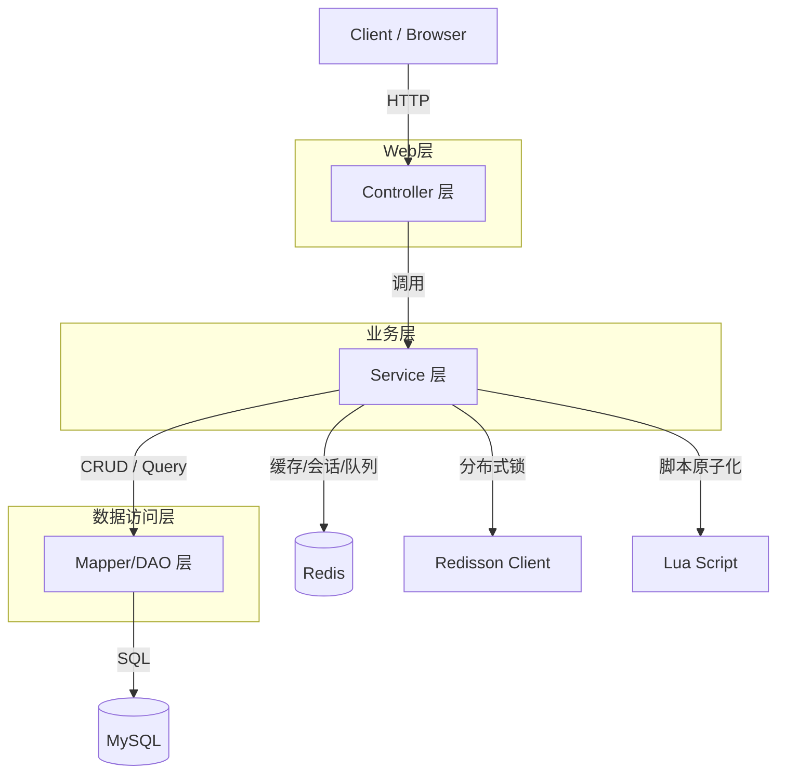
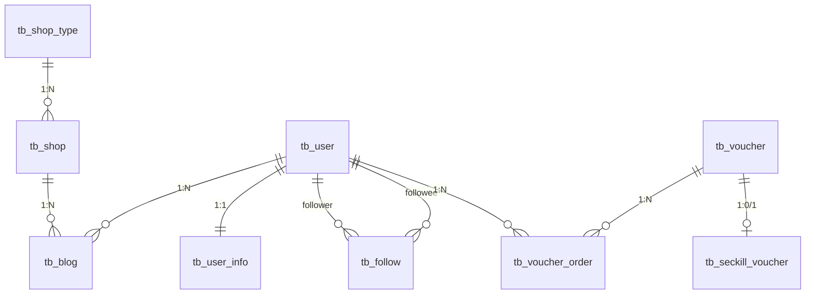
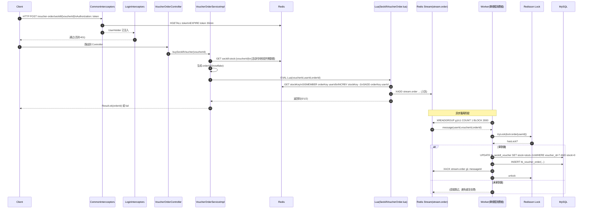

## 1. 项目整体架构概览

- **项目名称**：`hm-dianping`（仓库：`hm_dianping0`，后端模块：`back_end/hm-dianping`）
- **项目类型**：Spring Boot 单体应用（非微服务），典型分层 + 按业务域分包
- **项目目标与核心功能（从代码实际模块归纳）**：用户验证码登录与签到、店铺/类型查询与更新、附近商铺查询（GEO）、探店笔记发布/点赞、关注与共同关注、优惠券/秒杀券发布、秒杀下单（Lua + Stream 异步落库）、图片上传

### 单体架构划分方式

代码以**“层次分包 + 业务域聚合”**为主：
- **`controller/`**：HTTP API 入口，参数接收、返回统一 `Result`
- **`service/` + `service/impl/`**：业务编排与核心逻辑（含 Redis/锁/异步等）
- **`mapper/` + `resources/mapper/*.xml`**：数据访问层（MyBatis-Plus + 少量自定义 SQL）
- **`entity/`**：数据库表映射实体
- **`dto/`**：接口返回/登录表单等传输对象
- **`utils/`**：横切能力（缓存、锁、常量、ThreadLocal、正则、ID 生成等）
- **`config/`**：MVC 拦截器注册、MyBatis-Plus 分页插件、全局异常处理

### 各层职责边界（Controller / Service / DAO 等）

- **Controller**：只做“协议层”的工作（路径、参数、调用服务、返回 `Result`），不应承载复杂业务规则。
  - 现状：大部分 Controller 符合；但存在直接依赖实现类（如 `FollowController` 注入 `FollowServiceImpl`），降低可替换性。
- **Service**：业务规则、缓存策略、并发控制（Lua、锁）、异步消费、数据一致性处理。
  - 现状：核心复杂度集中在 `ShopServiceImpl`（缓存/GEO）与 `VoucherOrderServiceImpl`（秒杀链路）。
- **DAO(Mapper)**：面向表的 CRUD 与必要的 join 查询。
  - 现状：主要依赖 MyBatis-Plus 的 `BaseMapper`；`VoucherMapper.xml` 提供了券 + 秒杀券信息的左连接查询。

### 模块之间的依赖关系与解耦策略

- **典型依赖链**：`Controller -> Service接口/实现 -> Mapper -> MySQL`，并在 Service 内穿插 `Redis`、锁与异步。
- **解耦策略（已有）**：
  - 用 `I*Service` 接口隔离（如 `IBlogService`、`IVoucherOrderService`）
  - 统一返回包装 `Result`，降低前端解析成本
  - 登录态通过 `ThreadLocal(UserHolder)` 让业务层无需显式传参 userId
- **仍然耦合的点（需要在文档里记住）**：
  - Redis key 命名/前缀不一致（常量定义了 `login:token:`，但当前登录态直接用 `{token}` 当 key）
  - 部分能力“写在实现里”且缺初始化/契约（秒杀库存 key 的值类型、Stream 消费组创建等）

### 架构与调用关系图（可渲染）

#### 分层依赖关系（单体典型调用链）



#### 核心业务模块关系（按当前代码实际模块）

```mermaid
flowchart LR
  User[用户/登录/签到] --> RedisSession[Redis: code/token/sign(bitmap)]
  User --> MySQLUser[(MySQL: tb_user/tb_user_info)]

  Shop[店铺/店铺类型] --> RedisCache[Redis: cache:shop/shopType]
  Shop --> RedisGeo[Redis: shop:geo:*]
  Shop --> MySQLShop[(MySQL: tb_shop/tb_shop_type)]

  Social[关注/Feed/点赞/笔记] --> RedisSocial[Redis: follows/set, feed/zset, liked/zset]
  Social --> MySQLSocial[(MySQL: tb_follow/tb_blog)]

  Voucher[券/秒杀/订单] --> RedisSeckill[Redis: stock/order/stream]
  Voucher --> MySQLVoucher[(MySQL: tb_voucher/tb_seckill_voucher/tb_voucher_order)]
  Voucher --> RedissonLock[Redisson: lock:order{userId}]
```

## 2. 技术选型说明

### 各核心技术的选择原因

- **Java 8 + Spring Boot 2.7.18**
  - 单体快速迭代、生态成熟，适合课程/练手/中小型业务
- **MyBatis-Plus 3.4.3 + MySQL 8.0.33**
  - CRUD 与分页能力开箱即用（`MybatisConfig` 注入分页拦截器），降低样板代码
- **Redis（Spring Data Redis + Lettuce）**
  - 用于缓存、验证码、登录态、集合/有序集合、GEO、bitset、以及 Stream（轻量队列）
- **Redisson 3.13.6**
  - 用于分布式锁（秒杀落库阶段按 userId 粒度防并发/幂等），避免自研锁的边界坑
- **Lua（Redis Script）**
  - 把“校验库存 + 一人一单 + 扣库存 + 入队”做成原子操作，减少 RTT 与竞争窗口
- **Hutool / Lombok**
  - DTO/Map 转换、字符串工具、减少样板代码
- **Nginx（前端静态资源）**
  - 图片上传目录直接指向 Nginx 静态目录，简化“上传即访问”的闭环

### 放弃的备选方案及原因（单体语境）

- **JWT 无状态登录**
  - 可替代 Redis Session，但会带来撤销/续期/黑名单等复杂度；本项目更偏工程实践训练 Redis 结构
- **RabbitMQ/Kafka**
  - 更专业，但部署成本更高；本项目用 Redis Stream 达到“可 ACK + Pending 重试”的最小闭环
- **JPA/Hibernate**
  - 对复杂 SQL/性能控制不如 MyBatis 直观；MP 在练手项目中性价比更高

### 当前选型在单体场景下的利弊分析

- **优点**：实现快、热点/高并发能力可通过 Redis 组件快速补齐（缓存、锁、队列）
- **缺点**：Redis 既承担缓存又承担队列与状态，**契约与运维风险集中**；缺少统一配置管理与监控时，问题定位成本会上升

## 3. 核心业务模块详解（逐模块）

> 下面按“模块职责 → 核心类/接口 → 关键方法I/O/异常 → 典型流程”描述，均以当前代码为准。

### 模块A：用户与登录态（验证码登录 + token 会话 + ThreadLocal）

- **模块职责**
  - 发送验证码、验证码登录；维护登录态；提供“当前用户”访问；实现签到与签到统计（bitset）
- **核心类 / 接口**
  - `UserController`
  - `IUserService` / `UserServiceImpl`
  - `CommonIntercceptors`（解析 token、续期、写入 `UserHolder`）
  - `LoginInterceptors`（强制登录：401）
  - `UserHolder`（ThreadLocal）
  - `RegexUtils` / `RegexPatterns`
- **关键方法**
  - `UserServiceImpl.sendCode(phone, session)`
    - **输入**：手机号
    - **输出**：应返回 `Result.ok()`（但当前实现返回 `null`，属于技术债）
    - **异常**：手机号格式不合法 -> `Result.fail("手机号格式错误")`
    - **副作用**：写 Redis `login:code:{phone}`（TTL=2min）
  - `UserServiceImpl.login(loginForm, session)`
    - **输入**：`LoginFormDTO{phone, code}`
    - **输出**：`Result.ok(token)`
    - **异常**：验证码不匹配 -> `Result.fail("验证码错误！")`
    - **副作用**：写 Redis Hash（key=token，TTL=30min）
  - `CommonIntercceptors.preHandle()`
    - **输入**：HTTP Header `Authorization`（直接当 token key 使用）
    - **输出**：放行或放行并注入 `UserHolder`
    - **异常**：无（空 token 直接放行）
  - `LoginInterceptors.preHandle()`
    - **输入**：`UserHolder.getUser()`
    - **输出**：无用户则 `response.sendError(401)` 拦截
  - `UserServiceImpl.Sign()` / `signCount()`
    - **输入**：当前用户、当前日期
    - **输出**：签到成功或连续统计（当前实现是对 bitfield 结果做位计数，并非“连续天数”语义）
    - **副作用**：`SETBIT sign:{userId}:{yyyy/MM} day-1 true`
- **典型业务流程（接口→Redis/DB）**
  - `POST /user/code` → `sendCode()` → Redis String 写验证码
  - `POST /user/login` → `login()` → MySQL 查/建用户 → Redis Hash 写 token 会话 → 返回 token
  - 后续任意请求：`Authorization: {token}` → `CommonIntercceptors` 读 Hash → 续期 → 写 ThreadLocal → `LoginInterceptors` 放行

### 模块B：店铺查询与缓存（防穿透/逻辑过期/更新删缓存）

- **模块职责**
  - 店铺详情查询、更新；缓存防穿透；热点 key 逻辑过期异步重建
- **核心类 / 接口**
  - `ShopController`
  - `IShopService` / `ShopServiceImpl`
  - `CacheService`（通用缓存能力）
  - `RedisConstants`（key 前缀与 TTL）
- **关键方法**
  - `ShopServiceImpl.queryByID(id)`
    - **输入**：shopId
    - **输出**：`Result.ok(Shop)`
    - **异常**：无（未命中时 `CacheService` 可能返回 null）
    - **关键策略**：`CacheService.queryPassThrough("cache:shop:", id, Shop.class, this::getById, 30min)`
  - `CacheService.queryPassThrough(prefix, id, type, dbCallback, time, unit)`
    - **输入**：key 前缀、id、回源函数
    - **输出**：实体或 null
    - **异常**：无显式；回源异常会抛 `RuntimeException`
    - **关键策略**：缓存命中直接返回；未命中回源 DB；DB 空则写入空字符串
  - `ShopServiceImpl.updateUsingID(shop)`
    - **输入**：Shop（含 id）
    - **输出**：`Result.ok()`
    - **副作用**：先更新 DB，再删除 `cache:shop:{id}`（典型 Cache-Aside 失效策略）
- **典型业务流程**
  - `GET /shop/{id}` → `queryByID` → Redis 读 `cache:shop:{id}`
    - 命中：返回
    - 未命中：MySQL `tb_shop` 回源 → 写 Redis（或空值）→ 返回
  - `PUT /shop` → 更新 MySQL → 删除 Redis key，避免脏读

#### 店铺详情查询的缓存读写流程图（Cache-Aside + 防穿透）

```mermaid
flowchart TB
  A[GET /shop/{id}] --> B[ShopServiceImpl.queryByID]
  B --> C[CacheService.queryPassThrough]
  C --> D{Redis 命中?}
  D -- 是 --> E[反序列化 Shop JSON\n返回 Result.ok]
  D -- 否 --> F[回源 MySQL: tb_shop by id]
  F --> G{DB 有数据?}
  G -- 否 --> H[写入空值缓存(短 TTL 应更合适)\n返回空/404语义]
  G -- 是 --> I[写入 Shop JSON 缓存(30min)\n返回 Result.ok]
```

### 模块C：店铺类型列表缓存（List）

- **模块职责**
  - 返回店铺分类（通常变化不频繁）
- **核心类 / 接口**
  - `ShopTypeController`
  - `IShopTypeService` / `ShopTypeServiceImpl`
- **关键方法**
  - `ShopTypeServiceImpl.listType()`
    - **输入**：无
    - **输出**：`Result.ok(List<ShopType>)`
    - **缓存**：Redis List `shopType:`（TTL=30min）
- **典型业务流程**
  - `GET /shop-type/list` → 先 `LRANGE shopType:` → 命中反序列化 → 返回；未命中查 MySQL `tb_shop_type` → 写 List → 返回

### 模块D：附近商铺（Redis GEO + MySQL 二次查询）

- **模块职责**
  - 按类型 + 坐标查询附近商铺，并携带距离
- **核心类 / 接口**
  - `ShopController.queryShopByType`
  - `ShopServiceImpl.queryShopByType(typeId, current, x, y)`
- **关键方法**
  - **输入**：typeId、分页、x/y
  - **输出**：`Result.ok(List<Shop>)`（Shop 附加 distance）
  - **数据源**：
    - Redis GEO：`shop:geo:{typeId}` 做范围搜索与距离
    - MySQL：按 GEO 返回的 id 列表批量查 `tb_shop`，并用 `ORDER BY FIELD` 保序
- **典型业务流程**
  - `GET /shop/of/type?typeId=&current=&x=&y=`
    → GEOSEARCH 获取 0..end 的 shopId+distance
    → Java 端分页截取 from..end
    → MySQL `IN (ids)` 查询 + `FIELD` 排序
    → 回填 distance → 返回
  - 注：当前代码在 `x/y 为空` 分支里只查询了 `Page` 但未 `return`，属于技术债（见第9节）。

### 模块E：探店笔记（发布/热门/点赞/点赞列表/关注流Feed）

- **模块职责**
  - 发布笔记、按热度分页、点赞/取消点赞、点赞用户列表、关注流滚动分页
- **核心类 / 接口**
  - `BlogController`
  - `IBlogService` / `BlogServiceImpl`
  - 依赖：`IUserService`（补齐作者信息）、`IFollowService`（找粉丝/关注关系）
- **关键方法**
  - `BlogServiceImpl.saveBlog(blog)`
    - **输入**：Blog（内容/图片等）
    - **输出**：`Result.ok(blogId)`
    - **副作用**：
      - MySQL `tb_blog` 插入
      - 给“粉丝收件箱”写 ZSet：`feed:{followerUserId}:` score=时间戳，member=blogId
  - `BlogServiceImpl.likeBlog(id)`
    - **输入**：blogId
    - **输出**：`Result.ok()`
    - **副作用**：
      - MySQL `tb_blog.liked +/- 1`
      - Redis ZSet `blog:liked:{blogId}`：`ZADD`/`ZREM` 记录谁点过赞与时间
  - `BlogServiceImpl.queryBlogsOfFollow(lastId, offset)`
    - **输入**：滚动分页参数（lastId=上次最小 score，offset=同分偏移）
    - **输出**：`Result.ok(ScrollList{list,lastId,offset})`
    - **数据源**：Redis ZSet `feed:{userId}:`（按 score 倒序）
- **典型业务流程**
  - 发布：`POST /blog` → 插入 `tb_blog` → 读取关注关系（当前实现取 `followService.query().eq("user_id", userId)`，语义需核对）→ 写入各粉丝 `feed`
  - 点赞：`PUT /blog/like/{id}` → 查 `ZSCORE` 判断是否已赞 → 更新 DB liked → 更新 ZSet
  - 关注流：`GET /blog/of/follow` → ZREVRANGEBYSCORE+WITHSCORES → 组装滚动参数 → MySQL 批量查 blog → 返回

### 模块F：关注（关注/取关/共同关注）

- **模块职责**
  - 维护关注关系；支持共同关注查询
- **核心类 / 接口**
  - `FollowController`
  - `IFollowService` / `FollowServiceImpl`
- **关键方法**
  - `FollowServiceImpl.follow(id, isFollow)`
    - **输入**：目标用户 id、是否关注
    - **输出**：`Result.ok()`
    - **副作用**：
      - MySQL `tb_follow` 插入/删除
      - Redis Set `{userId}:follows:` 做镜像（便于共同关注交集）
  - `FollowServiceImpl.commonFollow(id)`
    - **输入**：另一个用户 id
    - **输出**：`Result.ok(List<UserDTO>)`
    - **数据源**：Redis `SINTER {userId}:follows: {id}:follows:` → MySQL 批量查用户 → DTO 返回
- **典型业务流程**
  - `PUT /follow/{id}/{isFollow}` → 更新 DB → 更新 Redis Set
  - `GET /follow/common/{id}` → Redis 交集 → DB 回源补齐用户信息

### 模块G：优惠券与秒杀券发布

- **模块职责**
  - 查询店铺券列表；发布普通券/秒杀券
- **核心类 / 接口**
  - `VoucherController`
  - `IVoucherService` / `VoucherServiceImpl`
  - `VoucherMapper.xml`：券表 + 秒杀券表左连接
- **关键方法**
  - `VoucherServiceImpl.queryVoucherOfShop(shopId)`
    - **输入**：shopId
    - **输出**：`Result.ok(List<Voucher>)`（含 `stock/begin_time/end_time`）
    - **数据源**：`tb_voucher` LEFT JOIN `tb_seckill_voucher`
  - `VoucherServiceImpl.addSeckillVoucher(voucher)`
    - **输入**：Voucher（含秒杀时间/库存）
    - **输出**：void（Controller 返回券 id）
    - **副作用**：
      - 写 MySQL `tb_voucher` 与 `tb_seckill_voucher`
      - 写 Redis `seckill:stock:{voucherId}`（当前写入的是 `SeckillVoucher` JSON，和 Lua 的“数字库存”契约冲突，见第9节）

### 模块H：秒杀下单（Lua 原子资格校验 + Redis Stream 异步落库）

- **模块职责**
  - 高并发下保证：**库存不超卖**、**一人一单**、**快速响应**、**最终落库**
- **核心类 / 接口**
  - `VoucherOrderController`
  - `IVoucherOrderService` / `VoucherOrderServiceImpl`
  - `SeckillVoucherOrder.lua`（Redis 脚本）
  - `SnowFlakeIDWorker`（订单号）
  - `RedissonClient`（按 userId 粒度锁）
- **关键方法**
  - `VoucherOrderServiceImpl.buySeckillVoucher(voucherId)`
    - **输入**：voucherId
    - **输出**：`Result.ok(orderId)` 或 `Result.fail(...)`
    - **异常**：脚本/Redis/解析失败抛 `RuntimeException`，由全局异常处理返回“服务器异常”
    - **关键策略**：
      - 先读 Redis `seckill:stock:{voucherId}` 做活动时间校验
      - 生成 orderId
      - 执行 Lua：检查库存、检查是否已下单、扣库存、记录下单用户、`XADD` 写入 `stream.order`
      - 立刻返回 orderId（真正落库异步完成）
  - `@PostConstruct init()` + `VoucherOrderHandler.run()`
    - **职责**：单线程持续消费 `stream.order`，处理订单落库并 `XACK`
    - **异常分支**：读取 pending list（从 `0`）做补偿重试
  - `createOrder(voucherOrder)`（`@Transactional`）
    - **职责**：MySQL 乐观扣减 `tb_seckill_voucher.stock`（`stock>0`）+ 插入 `tb_voucher_order`
- **典型业务流程**
  - `POST /voucher-order/seckill/{id}`（登录态必需）
    → Lua 原子完成资格校验与入队
    → 后台线程消费 Stream
    → Redisson 锁（`lock:order{userId}`）
    → MySQL 事务：扣库存 + 插入订单
    → ACK

### 模块I：文件上传（探店图片）

- **模块职责**
  - 上传图片到磁盘并返回相对路径；删除图片
- **核心类**
  - `UploadController`
  - `SystemConstants.IMAGE_UPLOAD_DIR`（硬编码路径）
- **关键方法**
  - `POST /upload/blog`：`MultipartFile` → 写入磁盘（分目录散列）→ 返回文件相对路径
  - `GET /upload/blog/delete?name=`：删除文件
- **典型业务流程**
  - 上传成功后，前端可直接拼接 Nginx 静态目录访问

### 模块J：评论（当前为空壳）

- **模块职责**：理论上承载探店评论
- **现状**：`BlogCommentsController` 与 `BlogCommentsServiceImpl` 几乎为空，仅有表 `tb_blog_comments` 与 mapper/entity 存在

## 4. 数据模型与数据库设计

### 核心表结构设计思路（按业务聚合）

### 数据模型关系图（简化 ER）



- **用户域**
  - `tb_user`：登录主体（phone、password、nick_name、icon）
  - `tb_user_info`：用户扩展信息（city/introduce/fans/followee/credits/level…），以 `user_id` 为主键实现 1:1
- **店铺域**
  - `tb_shop_type`：类型维表
  - `tb_shop`：店铺主表（含经纬度 x/y、均价、销量、评分等）
- **内容/社交域**
  - `tb_blog`：探店笔记（关联 `shop_id`、`user_id`）
  - `tb_follow`：关注关系（user_id → follow_user_id）
  - `tb_blog_comments`：评论（支持 parent/answer，具备二级回复结构）
- **交易域**
  - `tb_voucher`：优惠券主表（普通券/秒杀券通过 `type` 区分）
  - `tb_seckill_voucher`：秒杀扩展表（与 `tb_voucher` 1:1，主键为 `voucher_id`）
  - `tb_voucher_order`：订单表（以业务生成 id 为主键）

### 表之间的关系（逻辑关系，当前 SQL 关闭外键）

- `tb_user (1) -> (1) tb_user_info`
- `tb_shop_type (1) -> (N) tb_shop`
- `tb_shop (1) -> (N) tb_blog`
- `tb_user (1) -> (N) tb_blog`
- `tb_user (N) <-> (N) tb_user` 通过 `tb_follow` 自关联
- `tb_voucher (1) -> (0/1) tb_seckill_voucher`
- `tb_user (1) -> (N) tb_voucher_order`，`tb_voucher (1) -> (N) tb_voucher_order`

### 关键字段的业务含义（挑关键的）

- `tb_shop.x/y`：经纬度，用于 Redis GEO 半径搜索
- `tb_blog.images`：多图逗号分隔字符串（上传模块返回路径后拼接）
- `tb_voucher.type`：0 普通券 / 1 秒杀券
- `tb_seckill_voucher.begin_time/end_time/stock`：活动窗口与库存
- `tb_voucher_order.status/pay_type`：支付与履约状态机的雏形（当前代码未实现支付/核销流程）

### 索引设计及其目的（从 SQL 实际存在的索引）

- `tb_user`：`UNIQUE(phone)`，保证手机号唯一与登录查询效率
- `tb_shop`：`INDEX(type_id)`，支撑按类型筛选分页/附近查询的回源
- 其余表目前主要是主键索引；**缺失但建议补充**（见第9/第7节）：
  - `tb_follow(user_id, follow_user_id)` 唯一约束/联合索引（防重复关注、加速查询）
  - `tb_voucher_order(user_id, voucher_id)` 唯一约束（强制一人一单，抵御重试/补偿导致的重复写）
  - `tb_blog(user_id)`、`tb_blog(shop_id)` 索引（常见查询路径）

## 5. 请求处理全流程示例

以**秒杀下单**为例：`POST /voucher-order/seckill/{voucherId}`

### 秒杀请求时序图（从 HTTP 到最终落库）



### 从 HTTP 请求进入开始

1. 客户端发起请求，携带 Header：`Authorization: {token}`
2. `CommonIntercceptors`：
   - 读取 `Authorization`
   - Redis `HGETALL {token}` 得到 `UserDTO` 字段
   - 续期 `EXPIRE {token} 30min`
   - 写入 `UserHolder(ThreadLocal)`
3. `LoginInterceptors`：
   - 若 `UserHolder` 为空 → 直接 `401` 拦截

### 逐层说明处理过程（Controller → Service → Redis/Lua → Stream）

4. `VoucherOrderController.seckillVoucher(voucherId)` → 调用 `voucherOrderService.buySeckillVoucher(voucherId)`
5. `VoucherOrderServiceImpl.buySeckillVoucher`：
   - 读 Redis：`GET seckill:stock:{voucherId}`
   - 解析为 `SeckillVoucher` 并校验 `begin_time/end_time`
   - 生成订单号 `orderId = SnowFlakeIDWorker.nextId()`
   - 执行 Lua：`SeckillVoucherOrder.lua`
     - `GET seckill:stock:{voucherId}` 判断库存
     - `SISMEMBER seckill:order:{voucherId} userId` 判断是否重复
     - `INCRBY ... -1` 扣库存
     - `SADD ... userId` 记录已下单
     - `XADD stream.order ...` 把订单消息写入 Stream
   - 返回 `Result.ok(orderId)` 给客户端（此时 MySQL 尚未写入）

### 直到最终落库

6. 后台单线程消费者（`@PostConstruct` 启动）：
   - `XREADGROUP` 拉取 `stream.order`
   - 反序列化为 `VoucherOrder`
   - `Redisson tryLock(lock:order{userId})`（锁粒度：userId）
   - 调用 `createOrder(voucherOrder)`（事务）：
     - MySQL 扣减 `tb_seckill_voucher.stock`（`stock>0` 条件）
     - 插入 `tb_voucher_order`
   - `XACK` 确认消息
7. 如果消费异常：
   - 进入 pending-list 读取（从 `0`）重试
   - 直到 pending 清空

## 6. 异常处理与边界情况

### 常见异常类型

- **鉴权失败**：无 token 或 token 失效 → `LoginInterceptors` 返回 401
- **参数校验失败**：手机号格式不对 → `Result.fail("手机号格式错误")`
- **业务异常**：
  - 秒杀：活动未开始/已结束、库存不足、重复下单 → `Result.fail(...)`
  - 店铺/券信息不存在 → `Result.fail("信息不存在！")` 或返回空
- **系统异常**：Redis/DB 连接异常、JSON 解析异常、空指针 → 抛 `RuntimeException`

### 异常传播路径

- 大部分业务异常在 Service 内转为 `Result.fail` 并返回到 Controller
- 未捕获的运行时异常上抛到 `WebExceptionAdvice` → 统一返回 `Result.fail("服务器异常")`

### 全局异常处理机制

- `WebExceptionAdvice` 仅捕获 `RuntimeException`，记录日志后返回统一文案
  - **工程含义**：对外隐藏细节、对内保留堆栈；但代价是业务错误与系统错误难区分（建议第9节改进）。

## 7. 性能与稳定性考虑

### 当前项目中采取的优化手段（从代码落点总结）

- **缓存抗压**：`CacheService.queryPassThrough()` 防穿透；逻辑过期 + 互斥锁重建（热点思路已具备）
- **写扩散与读优化**：
  - Feed 收件箱：发布时写入粉丝 ZSet，读时滚动分页只查自己的收件箱
  - 点赞：ZSet 记录点赞人列表与时间，支持快速判断与排行榜式查询
- **地理检索**：Redis GEO 半径搜索 + MySQL 批量回源并保序
- **高并发秒杀**：
  - Lua 原子校验与扣库存，避免 DB 直接承压
  - Stream 异步落库 + ACK/Pending，减少请求线程耗时
  - Redisson 锁按 userId 粒度保障幂等
- **签到 bitset**：空间与写入成本低，适合高频轻量标记

### 未优化但可优化的点（明确列出）

- **秒杀消费端**：
  - 单线程消费者吞吐受限；可改为多消费者组/多消费者实例 + 分片 key
  - Stream 未做 `XTRIM`，长期可能膨胀
  - 未看到创建 consumer group（`XGROUP CREATE`）的初始化逻辑
- **缓存治理**：
  - 空值缓存 TTL 与正常 TTL 混用（会放大无效 key 占用）
  - 缺少统一 key 前缀与版本化策略（灰度/回滚困难）
- **数据库**：
  - 缺少关键联合索引与唯一约束（尤其 follow、voucher_order）
  - 缺少慢查询与连接池参数显式配置
- **稳定性**：
  - 缺少限流/熔断/降级与指标监控（QPS、Redis RTT、pending 长度等）

### 潜在性能瓶颈分析

- Redis 单点（既做缓存又做队列又做会话）：网络抖动或实例压力会放大连锁影响
- 秒杀落库阶段仍有 DB 更新热点行（`tb_seckill_voucher` 单行竞争）
- Feed/点赞 ZSet 长期增长未清理会造成内存压力
- 上传模块直接写本地磁盘 + 路径硬编码，部署迁移成本高

## 8. 可维护性与扩展性分析

### 当前结构下新增功能的成本

- **新增一个业务域（如“收藏”）**：新增 `controller/service/mapper/entity` 即可，成本中等
- **新增跨模块能力（如统一审计/灰度/多环境配置）**：当前缺少统一抽象与配置体系，成本偏高

### 哪些地方容易变复杂

- **Redis 契约**：同一个 key 的 value 类型/字段一旦不统一，会在 Lua/Java/运维之间产生隐性耦合
- **横切逻辑分散**：缓存策略、锁策略、队列策略都在具体 ServiceImpl 中，长期会“长胖”
- **接口依赖实现类**：降低可测试性与可替换性（Mock 困难）

### 如果未来演进为微服务，哪些模块可以拆

按数据与访问边界拆分较自然：
- **用户服务**：登录/会话/签到/用户资料
- **店铺服务**：店铺、店铺类型、GEO 数据维护
- **内容社交服务**：Blog、点赞、评论、Feed、关注关系
- **交易服务**：Voucher、SeckillVoucher、VoucherOrder、秒杀链路
- **媒体服务**：上传与图片资源（可转对象存储）

## 9. 已知问题与技术债

### 设计时的妥协 / 暂未解决的问题（以代码事实为准）

- **敏感信息与环境耦合**
  - `application.yaml`、`RedisConfig`、`SystemConstants.IMAGE_UPLOAD_DIR` 存在硬编码地址/账号/密码/路径（应迁移到环境变量或配置中心，且避免入库）
- **登录态 key 规范不一致**
  - `RedisConstants.LOGIN_USER_KEY=login:token:` 未使用；实际直接用 `{token}` 作为 key，降低可观测性与可清理性
- **用户模块**
  - `UserServiceImpl.sendCode()` 当前返回 `null`，会导致接口响应不符合统一 `Result` 约定
  - `logout` 未实现
- **店铺模块**
  - `ShopServiceImpl.queryShopByType()`：`x/y 为空` 分支未 `return`（逻辑缺口）
  - `results==null && results.getContent().isEmpty()` 存在空指针风险（应为 `||` 且先判空）
- **Blog 模块**
  - `initSingleBlog()` 判断是否点赞使用了作者 `userId` 而非“当前登录用户”，会导致 `isLike` 语义错误
- **缓存模块**
  - `CacheService.queryPassThrough()` 空值缓存 TTL 复用了正常 TTL（应使用 `CACHE_NULL_TTL` 短 TTL）
  - 命中空字符串时调用了 `Result.fail(...)` 但未返回该对象（实际返回 null），可读性与契约不清
- **秒杀链路（高优先级技术债）**
  - **Redis 库存 key 的值类型不一致**：Lua 按“数字库存”使用 `seckill:stock:{voucherId}`，但 `VoucherServiceImpl.addSeckillVoucher()` 写入的是 `SeckillVoucher` JSON
  - **Lua XADD 字段映射疑似写反**：脚本里 `userId`/`voucherId` 赋值顺序与 Java 传参不匹配（会导致消费者拿到错误字段）
  - **Stream 消费组创建缺失**：代码直接 `XREADGROUP g1/c1`，但未看到 `XGROUP CREATE` 初始化逻辑
  - **AOP 代理依赖未配置**：使用 `AopContext.currentProxy()` 但未看到 `@EnableAspectJAutoProxy(exposeProxy=true)`，存在运行时报错风险
- **自研锁实现不可用**
  - `RedisLock` 引用 `unlock.lua`，但资源目录为 `DelLock.lua`（命名不一致），且当前核心链路已改用 Redisson
- **评论模块空壳**
  - Controller/Service 未实现，表存在但业务不可用
- **数据库约束不足**
  - 外键检查关闭；缺少 `voucher_order(user_id,voucher_id)` 唯一约束与 `follow(user_id,follow_user_id)` 唯一约束，补偿/重试场景下容易产生脏数据

## 10. 总结与复盘

### 当前设计最成功的地方

- 把“单体应用也能做高并发关键路径”的核心手段跑通了：**Lua 原子化 + Stream 异步 + Redisson 锁 + MySQL 乐观扣减**
- Redis 数据结构覆盖面广且贴合业务：Hash 会话、List 类型列表、Set 关注、ZSet 点赞与 Feed、GEO 附近、bitset 签到

### 最值得重构的地方

- **统一 Redis 契约与初始化**：明确每个 key 的 value 类型、字段、TTL、写入/读取入口，并补齐 Stream group 创建与裁剪策略
- **修复明显逻辑缺口**：GEO 分支 return、isLike 判断、sendCode 返回、Lua 字段映射、库存值类型
- **配置外置化与安全治理**：去掉硬编码与敏感信息入库，区分 dev/test/prod 配置
- **增强数据约束**：补齐必要唯一索引，靠 DB 做最后一道幂等兜底

### 对“当初的自己”的改进建议

- 在引入 Redis/队列/Lua 之前先写一份“数据契约清单”（key 模式、类型、字段、TTL、幂等策略），并用最小集成测试覆盖关键链路（秒杀、登录、缓存回源）
- 任何“异步最终一致性”链路都要同时具备：**消息可追踪（监控）、可重试（pending/补偿）、可幂等（唯一约束）**
- 代码层面坚持接口依赖与分层边界：Controller 只依赖 `I*Service`，把缓存/锁/队列能力抽成可复用组件，避免 ServiceImpl 失控膨胀


