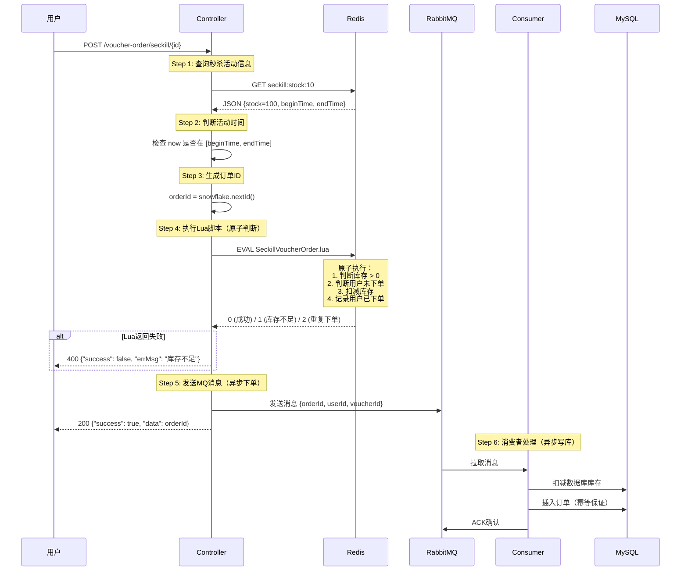
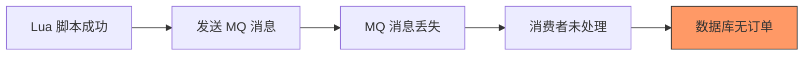
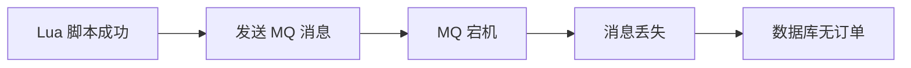
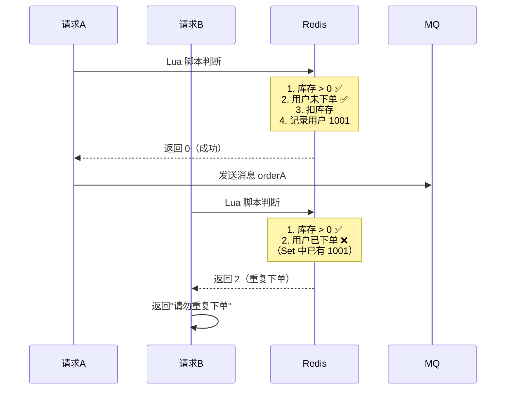

# 优惠券模块深度解析 - 工程实践视角

> **角色定位**：高并发系统 Java 后端工程师  
> **项目背景**：黑马点评 - Spring Boot + MyBatis-Plus + Redis + MySQL + RabbitMQ  
> **核心模块**：秒杀优惠券 - 高并发抢券与一人一单约束  
> **适用场景**：中高级后端面试、高并发系统设计

---

## 1️⃣ 优惠券模块在项目中的【业务定位】

### 模块职责划分

优惠券模块对外提供三个核心能力：

1. **查券**：展示商铺可用优惠券（普通券 + 秒杀券）
2. **发券**：用户领取优惠券（核心是秒杀券的高并发抢占）
3. **记录**：用户优惠券订单状态管理（已领取、已使用、已过期）

### 普通优惠券 vs 秒杀优惠券的本质区别

| 对比维度 | 普通优惠券 | 秒杀优惠券 |
|---------|-----------|-----------|
| **业务特性** | 长期有效，随时可领 | 限时限量，瞬时开抢 |
| **并发特性** | 流量分散，常规峰值 | **脉冲式流量**，瞬时高峰 |
| **一致性要求** | 弱一致性可接受 | **强一致性**（库存不能超卖） |
| **技术挑战** | 查询性能优化 | **热点行竞争 + 瞬时写放大** |
| **存储策略** | 数据库为主 | **Redis + 数据库双层** |

**本质区别**：秒杀券是**抢占式资源分配**，要求在极短时间（毫秒级）内完成"库存扣减 + 一人一单校验"，且不能出错。

### 为什么秒杀优惠券是整个系统并发最高的点？

#### 流量特征
- **集中度极高**：10:00 整点开抢，90% 请求集中在前 3 秒
- **重复请求多**：用户疯狂点击，同一用户可能发起 10+ 次请求
- **瞬时 QPS 极高**：平时 100 QPS，开抢瞬间可能飙到 10,000+ QPS

#### 技术挑战
```java
// 如果直接打数据库，会发生什么？
UPDATE tb_seckill_voucher 
SET stock = stock - 1 
WHERE voucher_id = 10 AND stock > 0;

// 问题：
// 1. 热点行锁竞争：所有请求都在争抢同一行（voucher_id=10）的行锁
// 2. 唯一索引冲突：uk_user_voucher(user_id, voucher_id) 大量重复检查
// 3. 连接池耗尽：数据库连接被大量慢查询占满
// 4. 主从延迟：主库写入压力过大，从库复制延迟飙升
```

**工程结论**：秒杀场景必须把"资格判定"前置到 Redis，用"先判资格、再写库"的模式削峰填谷。

---

## 2️⃣ 【秒杀整体流程拆解（重点）】

### 完整流程（从用户点击到抢券成功）



### 流程关键节点详解

#### 节点 1：查询秒杀活动信息（Redis）
```java
// 代码位置：VoucherOrderServiceImpl.java L64-68
String json = stringRedisTemplate.opsForValue().get(RedisConstants.SECKILL_STOCK_KEY + voucherId);
SeckillVoucher seckillVoucher = JSONUtil.toBean(json, SeckillVoucher.class);

// Redis Key: seckill:stock:10
// Value: {"voucherId":10, "stock":100, "beginTime":"2026-01-23T10:00:00", "endTime":"2026-01-23T12:00:00"}
```

**工程要点**：
- 活动信息提前预热到 Redis（在 `addSeckillVoucher()` 时写入）
- 避免每次请求都查数据库，降低数据库压力

#### 节点 2：判断活动时间（Java 本地判断）
```java
// 代码位置：VoucherOrderServiceImpl.java L71-76
if (seckillVoucher.getBeginTime().isAfter(LocalDateTime.now())) {
    return Result.fail("活动还未开始！");
}
if (seckillVoucher.getEndTime().isBefore(LocalDateTime.now())) {
    return Result.fail("活动已经结束！");
}
```

**为什么不放在 Lua 脚本里判断？**
- 时间判断不是"竞争资源"，Java 本地判断即可
- 减少 Lua 脚本复杂度，降低 Redis 压力
- 活动未开始/已结束时，直接快速失败，不占用 Redis 资源

#### 节点 3：生成订单 ID（雪花算法）
```java
// 代码位置：VoucherOrderServiceImpl.java L79-80
Long userId = UserHolder.getUser().getId();
long orderId = snowFlakeIDWorker.nextId();
```

**工程要点**：
- 订单 ID 必须在 Redis 判断**之前**生成
- 原因：Lua 脚本不支持生成分布式 ID，必须外部传入
- 雪花算法保证全局唯一性

#### 节点 4：执行 Lua 脚本（Redis 原子判断）
```java
// 代码位置：VoucherOrderServiceImpl.java L83-89
Long res = stringRedisTemplate.execute(
        SECKILL_VOUCHER_ORDER,
        Collections.emptyList(),  // 无需传 KEYS
        voucherId.toString(),     // ARGV[1]
        userId.toString(),        // ARGV[2]
        String.valueOf(orderId)   // ARGV[3]
);
```

**Lua 脚本内容**（`SeckillVoucherOrder.lua`）：
```lua
-- 1. 参数列表
local voucherId = ARGV[1]
local userId = ARGV[2]

-- 2. 数据key
local stockKey = 'seckill:stock:'..voucherId      -- 库存key
local orderKey = 'seckill:order:'..voucherId      -- 订单key (Set)

-- 3. 脚本业务
-- 3.1 判断库存是否充足
if (tonumber(redis.call('get', stockKey)) <= 0) then
    return 1  -- 库存不足
end

-- 3.2 判断用户是否下单
if (redis.call('sismember', orderKey, userId) == 1) then
    return 2  -- 重复下单
end

-- 3.3 扣库存
redis.call('incrby', stockKey, -1)

-- 3.4 记录用户已下单
redis.call('sadd', orderKey, userId)

return 0  -- 成功
```

**流程说明**：
1. Redis 中存在两个关键数据结构：
   - `seckill:stock:10`（String）：当前库存数量
   - `seckill:order:10`（Set）：已下单用户 ID 集合
2. Lua 脚本原子执行 4 个操作
3. 返回值：0=成功，1=库存不足，2=重复下单

#### 节点 5：发送 MQ 消息（异步下单）
```java
// 代码位置：VoucherOrderServiceImpl.java L96-102
VoucherOrderMessage message = new VoucherOrderMessage(orderId, userId, voucherId);
boolean sendSuccess = sendMessageWithRetry(message, orderId);

if (!sendSuccess) {
    // 重试 3 次还失败，记录错误日志，依赖对账兜底
    log.error("消息发送彻底失败，需对账补偿！orderId: {}, userId: {}, voucherId: {}", 
              orderId, userId, voucherId);
}
```

**消息发送带重试**（`sendMessageWithRetry()`）：
```java
// 代码位置：VoucherOrderServiceImpl.java L113-144
private boolean sendMessageWithRetry(VoucherOrderMessage message, Long orderId) {
    for (int i = 0; i < MAX_RETRY; i++) {  // MAX_RETRY = 3
        try {
            rabbitTemplate.convertAndSend(
                    RabbitMQConfig.SECKILL_EXCHANGE,
                    RabbitMQConfig.SECKILL_ORDER_ROUTING_KEY,
                    message
            );
            log.info("消息发送成功（尝试 {}/{}），orderId: {}", i + 1, MAX_RETRY, orderId);
            return true;
        } catch (Exception e) {
            log.warn("消息发送失败（尝试 {}/{}），orderId: {}, 错误: {}", 
                     i + 1, MAX_RETRY, orderId, e.getMessage());
            if (i < MAX_RETRY - 1) {
                Thread.sleep(RETRY_INTERVAL);  // 100ms
            }
        }
    }
    return false;
}
```

**工程要点**：
- 消息发送失败不影响用户体验（已扣减 Redis 库存，用户收到成功响应）
- 依赖对账系统兜底（定时任务扫描 Redis 已扣库存但数据库无订单的记录）

#### 节点 6：消费者处理（异步写库）
```java
// 代码位置：VoucherOrderConsumer.java L26-46
@RabbitListener(queues = RabbitMQConfig.SECKILL_ORDER_QUEUE, 
                containerFactory = "rabbitListenerContainerFactory")
public void handleVoucherOrder(VoucherOrderMessage orderMessage, 
                               Message message, 
                               Channel channel) {
    long deliveryTag = message.getMessageProperties().getDeliveryTag();
    
    try {
        // 处理订单业务逻辑
        processOrder(orderMessage);
        
        // 成功确认
        safeAck(channel, deliveryTag);
        log.info("订单处理成功: {}", orderMessage.getId());
        
    } catch (Exception e) {
        log.error("处理订单失败: {}", orderMessage, e);
        handleFailure(channel, deliveryTag, message);  // 重试或进死信队列
    }
}
```

**订单创建逻辑**（`createOrder()`）：
```java
// 代码位置：VoucherOrderServiceImpl.java L150-176
@Transactional
public void createOrder(VoucherOrder voucherOrder) {
    try {
        // 1. 扣减数据库库存
        boolean success = seckillVoucherService.update()
                .setSql("stock=stock-1")
                .eq("voucher_id", voucherOrder.getVoucherId())
                .gt("stock", 0)  // 再次校验库存 > 0
                .update();

        if (!success) {
            log.error("优惠券库存不足! voucherId: {}", voucherOrder.getVoucherId());
            throw new RuntimeException("优惠券库存不足");
        }

        // 2. 保存订单（数据库唯一索引保证一人一单）
        save(voucherOrder);
        log.info("订单创建成功: orderId={}, userId={}, voucherId={}", 
                 voucherOrder.getId(), voucherOrder.getUserId(), voucherOrder.getVoucherId());
        
    } catch (org.springframework.dao.DuplicateKeyException e) {
        // 重复键异常 = 幂等成功（用户已下过单）
        log.info("订单已存在（幂等），跳过: userId={}, voucherId={}", 
                 voucherOrder.getUserId(), voucherOrder.getVoucherId());
        // 不抛异常，让消费者正常ACK
    }
}
```

### 流程总结：哪些步骤在 Redis，哪些在数据库

| 步骤 | 执行位置 | 作用 | 是否阻塞用户请求 |
|------|---------|------|----------------|
| 查询活动信息 | Redis | 获取活动时间、库存信息 | ✅ 是 |
| 判断活动时间 | Java 本地 | 快速失败 | ✅ 是 |
| Lua 脚本判断 | Redis | **原子判断库存 + 一人一单** | ✅ 是 |
| 发送 MQ 消息 | RabbitMQ | 异步写库 | ✅ 是（但超快） |
| 扣减数据库库存 | MySQL | 持久化库存扣减 | ❌ 否（异步） |
| 插入订单记录 | MySQL | 持久化订单数据 | ❌ 否（异步） |

**核心设计理念**：
- **Redis 负责快速判定**（100 微秒级）
- **数据库负责持久化**（异步，秒级完成）
- **用户请求 RT 极低**（<50ms）

---

## 3️⃣ 【Redis 在这个模块中的核心作用】

### Redis 数据结构设计

#### 1. 秒杀库存（String）
```redis
# Key: seckill:stock:10
# Value: 100（当前剩余库存）
# 操作：INCRBY seckill:stock:10 -1
```

**初始化时机**（`VoucherServiceImpl.addSeckillVoucher()`）：
```java
// 代码位置：VoucherServiceImpl.java L64
stringRedisTemplate.opsForValue().set(
    SECKILL_STOCK_KEY + voucher.getId(), 
    JSONUtil.toJsonStr(seckillVoucher)
);
```

**工程要点**：
- 库存初始化在管理后台添加秒杀券时完成
- 如果 Redis 宕机重启，需要从数据库重新预热
- 库存扣减使用 `INCRBY -1`，不是 `DECR`（更清晰表达业务语义）

#### 2. 已下单用户集合（Set）
```redis
# Key: seckill:order:10
# Value: {1001, 1002, 1003}（已下单用户ID集合）
# 操作：SADD seckill:order:10 1001
```

**为什么用 Set？**
- `SISMEMBER` 时间复杂度 O(1)，判断用户是否已下单极快
- Set 天然去重，符合"一人一单"语义
- 空间占用：假设 10 万人抢券，每个 userId 8 字节，仅占用 800KB

**对比其他方案**：
| 方案 | 时间复杂度 | 空间占用 | 过期策略 |
|------|-----------|---------|---------|
| Set | O(1) | 中等 | 手动删除 |
| Bitmap | O(1) | 极小（10万人仅12.5KB） | 手动删除 |
| Hash | O(1) | 大（需存timestamp等） | 支持 TTL |

**为什么不用 Bitmap？**
- userId 不连续（雪花算法生成），Bitmap 会浪费大量空间
- Set 更直观，便于调试和运维

### 为什么必须使用 Lua，而不能用普通 Redis 命令？

#### 错误示范：不用 Lua 的实现
```java
// ❌ 错误写法：分步执行 Redis 命令
public Result buySeckillVoucher(Long voucherId, Long userId) {
    // 1. 判断库存
    Integer stock = Integer.parseInt(stringRedisTemplate.opsForValue().get(stockKey));
    if (stock <= 0) {
        return Result.fail("库存不足");
    }
    
    // 2. 判断是否已下单
    Boolean isMember = stringRedisTemplate.opsForSet().isMember(orderKey, userId.toString());
    if (isMember) {
        return Result.fail("重复下单");
    }
    
    // 3. 扣库存
    stringRedisTemplate.opsForValue().increment(stockKey, -1);
    
    // 4. 记录用户已下单
    stringRedisTemplate.opsForSet().add(orderKey, userId.toString());
    
    return Result.ok();
}
```

#### 并发问题分析

**场景：100 个库存，200 个用户同时抢券**

| 时间线 | 线程 A（用户 1001） | 线程 B（用户 1002） | Redis 实际库存 |
|-------|-------------------|-------------------|---------------|
| T1 | 读取库存 = 1 | - | 1 |
| T2 | 判断库存 > 0，通过 ✅ | 读取库存 = 1 | 1 |
| T3 | - | 判断库存 > 0，通过 ✅ | 1 |
| T4 | 扣库存：stock = 0 | - | 0 |
| T5 | - | 扣库存：stock = -1 ❌ | **-1（超卖！）** |

**问题本质**：
- 步骤 1-4 不是原子操作，存在"检查-执行"时间窗口
- 两个线程都通过了"库存 > 0"检查，然后都去扣库存
- 最终库存变成 -1，**超卖发生**

#### Lua 脚本的原子性保证

```lua
-- Redis 单线程模型 + Lua 脚本原子执行
-- 步骤 1-4 在 Redis 内部一次性完成，中间不会被其他命令打断

if (tonumber(redis.call('get', stockKey)) <= 0) then
    return 1
end
if (redis.call('sismember', orderKey, userId) == 1) then
    return 2
end
redis.call('incrby', stockKey, -1)  -- 这行执行时，库存一定 > 0
redis.call('sadd', orderKey, userId)
return 0
```

**工程结论**：
- Lua 脚本利用 Redis 单线程特性，保证"判断 + 扣减"原子性
- 即使 10,000 个请求同时到达，Redis 也会串行执行 Lua 脚本
- 库存绝不会超卖，一人一单绝不会违反

---

## 4️⃣ 【Lua 脚本的工程意义】

### 脚本里做了哪几件"必须原子完成"的事？

```lua
-- SeckillVoucherOrder.lua 完整分析

-- ===== 原子操作 1：判断库存 =====
if (tonumber(redis.call('get', stockKey)) <= 0) then
    return 1  -- 快速失败，不执行后续操作
end

-- ===== 原子操作 2：判断一人一单 =====
if (redis.call('sismember', orderKey, userId) == 1) then
    return 2  -- 快速失败，不执行后续操作
end

-- ===== 原子操作 3：扣减库存 =====
redis.call('incrby', stockKey, -1)

-- ===== 原子操作 4：记录用户已下单 =====
redis.call('sadd', orderKey, userId)

return 0  -- 所有操作都成功
```

**关键点**：
- 操作 1 和 2 是**先决条件判断**
- 操作 3 和 4 是**状态变更**
- 四个操作要么全成功，要么全失败（前面失败则不执行后面）

### 如果不用 Lua，会出现哪些并发问题？

#### 问题 1：库存超卖
```java
// 场景：最后 1 个库存，2 个用户同时抢
// 线程 A 和 B 同时读到 stock=1，都通过检查，最终库存变成 -1
Integer stock = redisTemplate.opsForValue().get(stockKey);  // 非原子
if (stock > 0) {
    redisTemplate.opsForValue().increment(stockKey, -1);  // 非原子
}
```

#### 问题 2：一人多单
```java
// 场景：用户疯狂点击，发起 10 次请求
// 多个请求同时通过"未下单"检查，最终 Set 中只记录一次，但发了多条 MQ 消息
Boolean isMember = redisTemplate.opsForSet().isMember(orderKey, userId);  // 非原子
if (!isMember) {
    redisTemplate.opsForSet().add(orderKey, userId);  // 非原子
    sendMQ(orderId, userId, voucherId);  // 发了多次 MQ
}
```

#### 问题 3：状态不一致
```java
// 场景：扣库存成功，但记录用户下单失败（Redis 宕机、网络抖动）
redisTemplate.opsForValue().increment(stockKey, -1);  // 成功
// 此时 Redis 宕机
redisTemplate.opsForSet().add(orderKey, userId);  // 失败
// 结果：库存扣了，但用户可以再次抢券（一人多单）
```

### Lua 脚本失败时，系统状态是否安全？

#### 场景 1：Lua 脚本执行中 Redis 宕机
```lua
redis.call('incrby', stockKey, -1)  -- 执行到这里，Redis 宕机
redis.call('sadd', orderKey, userId)  -- 未执行
```

**结果**：
- Redis 宕机后，内存数据全部丢失（未持久化）
- **系统状态安全**：数据库中无订单，用户可以重新抢券
- **依赖 RDB/AOF 持久化**：如果开启持久化，Redis 重启后数据可恢复

#### 场景 2：Lua 脚本返回失败（库存不足 / 重复下单）
```java
Long res = stringRedisTemplate.execute(SECKILL_VOUCHER_ORDER, ...);
if (res.intValue() != 0) {
    return Result.fail(res.intValue() == 1 ? "库存不足!" : "请勿重复下单！");
}
```

**结果**：
- Lua 脚本返回非 0 值，Java 代码直接返回失败
- **系统状态安全**：Redis 和数据库都未变更
- **用户体验**：立即收到失败反馈，可以尝试其他优惠券

#### 场景 3：Lua 脚本成功，但 MQ 发送失败
```java
Long res = stringRedisTemplate.execute(SECKILL_VOUCHER_ORDER, ...);  // 成功
boolean sendSuccess = sendMessageWithRetry(message, orderId);  // 失败
if (!sendSuccess) {
    log.error("消息发送彻底失败，需对账补偿！orderId: {}", orderId);
}
return Result.ok(orderId);  // 仍然返回成功
```

**结果**：
- Redis 库存已扣减，用户已记录为"已下单"
- 数据库中无订单（MQ 消息丢失）
- **系统状态不一致**：需要依赖对账系统兜底

**兜底方案**：
```java
// 定时任务：每分钟扫描 Redis 中已扣库存但数据库无订单的记录
@Scheduled(cron = "0 * * * * ?")
public void reconcileOrders() {
    Set<String> userIds = redisTemplate.opsForSet().members("seckill:order:10");
    for (String userId : userIds) {
        // 检查数据库是否存在订单
        VoucherOrder order = voucherOrderService.getOne(
            new QueryWrapper<VoucherOrder>()
                .eq("user_id", userId)
                .eq("voucher_id", 10)
        );
        if (order == null) {
            // 补发 MQ 消息
            VoucherOrderMessage message = new VoucherOrderMessage(orderId, userId, 10);
            rabbitTemplate.convertAndSend(SECKILL_EXCHANGE, SECKILL_ORDER_ROUTING_KEY, message);
            log.warn("对账补偿：补发订单消息，userId: {}, voucherId: {}", userId, 10);
        }
    }
}
```

---

## 5️⃣ 【数据库落库设计】

### 表结构设计

#### 1. 优惠券表（tb_voucher）
```sql
CREATE TABLE `tb_voucher` (
  `id` bigint(20) UNSIGNED NOT NULL AUTO_INCREMENT COMMENT '主键',
  `shop_id` bigint(20) UNSIGNED NULL DEFAULT NULL COMMENT '商铺id',
  `title` varchar(255) NOT NULL COMMENT '代金券标题',
  `sub_title` varchar(255) NULL DEFAULT NULL COMMENT '副标题',
  `rules` varchar(1024) NULL DEFAULT NULL COMMENT '使用规则',
  `pay_value` bigint(10) UNSIGNED NOT NULL COMMENT '支付金额，单位是分',
  `actual_value` bigint(10) NOT NULL COMMENT '抵扣金额，单位是分',
  `type` tinyint(1) UNSIGNED NOT NULL DEFAULT 0 COMMENT '0,普通券；1,秒杀券',
  `status` tinyint(1) UNSIGNED NOT NULL DEFAULT 1 COMMENT '1,上架; 2,下架; 3,过期',
  `create_time` timestamp NOT NULL DEFAULT CURRENT_TIMESTAMP,
  `update_time` timestamp NOT NULL DEFAULT CURRENT_TIMESTAMP ON UPDATE CURRENT_TIMESTAMP,
  PRIMARY KEY (`id`)
) ENGINE = InnoDB;
```

**职责**：存储优惠券基本信息（标题、金额、类型、状态）

#### 2. 秒杀券表（tb_seckill_voucher）
```sql
CREATE TABLE `tb_seckill_voucher` (
  `voucher_id` bigint(20) UNSIGNED NOT NULL COMMENT '关联的优惠券的id',
  `stock` int(8) NOT NULL COMMENT '库存',
  `begin_time` timestamp NOT NULL COMMENT '生效时间',
  `end_time` timestamp NOT NULL COMMENT '失效时间',
  `create_time` timestamp NOT NULL DEFAULT CURRENT_TIMESTAMP,
  `update_time` timestamp NOT NULL DEFAULT CURRENT_TIMESTAMP ON UPDATE CURRENT_TIMESTAMP,
  PRIMARY KEY (`voucher_id`)
) ENGINE = InnoDB COMMENT = '秒杀优惠券表，与优惠券是一对一关系';
```

**职责**：存储秒杀券特有信息（库存、活动时间）

**设计理念**：
- `voucher_id` 是主键，与 `tb_voucher` 一对一
- 库存字段在这张表中，扣减操作只影响秒杀券记录
- 活动时间存储在这里，方便秒杀活动的独立管理

#### 3. 用户优惠券订单表（tb_voucher_order）
```sql
CREATE TABLE `tb_voucher_order` (
  `id` bigint(20) NOT NULL COMMENT '主键',
  `user_id` bigint(20) UNSIGNED NOT NULL COMMENT '下单的用户id',
  `voucher_id` bigint(20) UNSIGNED NOT NULL COMMENT '购买的代金券id',
  `pay_type` tinyint(1) UNSIGNED NOT NULL DEFAULT 1 COMMENT '支付方式',
  `status` tinyint(1) UNSIGNED NOT NULL DEFAULT 1 COMMENT '订单状态',
  `create_time` timestamp NOT NULL DEFAULT CURRENT_TIMESTAMP COMMENT '下单时间',
  `pay_time` timestamp NULL DEFAULT NULL COMMENT '支付时间',
  `use_time` timestamp NULL DEFAULT NULL COMMENT '核销时间',
  `refund_time` timestamp NULL DEFAULT NULL COMMENT '退款时间',
  `update_time` timestamp NOT NULL DEFAULT CURRENT_TIMESTAMP ON UPDATE CURRENT_TIMESTAMP,
  PRIMARY KEY (`id`),
  UNIQUE KEY `uk_user_voucher` (`user_id`, `voucher_id`) COMMENT '一人一券一单约束'
) ENGINE = InnoDB;
```

**职责**：记录用户领取优惠券的订单（包含订单状态、支付时间、核销时间）

**核心约束**：
```sql
UNIQUE KEY `uk_user_voucher` (`user_id`, `voucher_id`)
```

### 为什么数据库层仍然要做约束？

#### Redis 保证不够的场景

| 场景 | Redis 是否能防 | 数据库约束是否能防 |
|------|--------------|----------------|
| 并发抢券（正常流程） | ✅ 能 | ✅ 能 |
| Redis 宕机后，从库切主库 | ❌ 不能 | ✅ 能 |
| 恶意用户绕过接口直接插数据库 | ❌ 不能 | ✅ 能 |
| MQ 消息重复消费 | ❌ 不能 | ✅ 能 |
| 程序 Bug 导致重复下单 | ❌ 不能 | ✅ 能 |

#### 数据库约束的作用

```java
// 代码位置：VoucherOrderServiceImpl.java L165-174
try {
    save(voucherOrder);  // 插入订单
} catch (org.springframework.dao.DuplicateKeyException e) {
    // 唯一索引冲突 = 幂等成功
    log.info("订单已存在（幂等），跳过: userId={}, voucherId={}", 
             voucherOrder.getUserId(), voucherOrder.getVoucherId());
    // 不抛异常，让消费者正常 ACK
}
```

**工程要点**：
- 数据库唯一索引是**最后一道防线**
- 即使 Redis 判断被绕过，数据库仍然能保证一人一单
- 捕获 `DuplicateKeyException` 实现幂等（消息重复消费时不报错）

### Redis 成功 ≠ 业务一定成功，为什么？

#### 问题场景



**具体例子**：
1. Lua 脚本执行成功，Redis 库存扣减 100 → 99
2. 发送 MQ 消息成功
3. **RabbitMQ 宕机**，消息未持久化，丢失
4. 消费者永远收不到消息
5. 数据库中无订单记录

**后果**：
- 用户收到"抢券成功"响应
- 但数据库中查不到订单
- **Redis 库存已扣减，但数据库库存未扣减**

#### 解决方案

##### 方案 1：MQ 消息持久化 + 手动 ACK
```java
// RabbitMQ 配置：VoucherOrderConsumer.java L25-46
@RabbitListener(queues = RabbitMQConfig.SECKILL_ORDER_QUEUE)
public void handleVoucherOrder(...) {
    try {
        processOrder(orderMessage);
        channel.basicAck(deliveryTag, false);  // 手动 ACK
    } catch (Exception e) {
        handleFailure(channel, deliveryTag, message);  // 重试或进死信队列
    }
}
```

**工程要点**：
- 队列持久化：`QueueBuilder.durable(SECKILL_ORDER_QUEUE)`
- 消息持久化：`MessageProperties.PERSISTENT_TEXT_PLAIN`
- 手动 ACK：`AcknowledgeMode.MANUAL`

##### 方案 2：对账系统兜底
```java
// 每小时扫描 Redis 与数据库的差异
@Scheduled(cron = "0 0 * * * ?")
public void reconcile() {
    // 1. 获取 Redis 中所有已扣库存的券
    Set<String> redisKeys = redisTemplate.keys("seckill:order:*");
    
    for (String redisKey : redisKeys) {
        Long voucherId = extractVoucherId(redisKey);
        Set<String> userIds = redisTemplate.opsForSet().members(redisKey);
        
        for (String userId : userIds) {
            // 2. 检查数据库是否存在订单
            VoucherOrder order = voucherOrderService.getOne(
                new QueryWrapper<VoucherOrder>()
                    .eq("user_id", userId)
                    .eq("voucher_id", voucherId)
            );
            
            if (order == null) {
                // 3. 补发 MQ 消息
                log.warn("对账发现数据不一致，补发消息: userId={}, voucherId={}", 
                         userId, voucherId);
                VoucherOrderMessage message = new VoucherOrderMessage(
                    snowFlakeIDWorker.nextId(), Long.parseLong(userId), voucherId
                );
                rabbitTemplate.convertAndSend(SECKILL_EXCHANGE, 
                                              SECKILL_ORDER_ROUTING_KEY, 
                                              message);
            }
        }
    }
}
```

---

## 6️⃣ 【异步下单 / 消息队列】

### 为什么要把"抢券成功"和"写数据库"拆开？

#### 同步写库的问题

```java
// ❌ 同步写库（假设不用 MQ）
public Result buySeckillVoucher(Long voucherId) {
    // 1. Lua 脚本判断（耗时 1ms）
    Long res = executeRedisLua(...);
    if (res != 0) return Result.fail();
    
    // 2. 扣减数据库库存（耗时 50ms）
    seckillVoucherService.update()
        .setSql("stock=stock-1")
        .eq("voucher_id", voucherId)
        .update();
    
    // 3. 插入订单（耗时 30ms）
    voucherOrderService.save(order);
    
    // 总耗时：1 + 50 + 30 = 81ms
    return Result.ok(orderId);
}
```

**问题分析**：
| 指标 | 同步写库 | 异步写库（MQ） |
|------|---------|---------------|
| 用户请求 RT | 81ms | 5ms（仅 Redis） |
| 系统吞吐量 | 1000/s | 20,000/s |
| 数据库压力 | 极高（10,000 QPS） | 低（消费者可控） |
| 用户体验 | 等待时间长 | 秒级返回 |

#### 异步写库的优势

```java
// ✅ 异步写库（使用 MQ）
public Result buySeckillVoucher(Long voucherId) {
    // 1. Lua 脚本判断（耗时 1ms）
    Long res = executeRedisLua(...);
    if (res != 0) return Result.fail();
    
    // 2. 发送 MQ 消息（耗时 2ms）
    rabbitTemplate.convertAndSend(...);
    
    // 总耗时：1 + 2 = 3ms
    return Result.ok(orderId);
}
```

**优势**：
1. **用户体验极佳**：请求耗时从 80ms 降到 3ms
2. **数据库削峰**：10,000 QPS 的抢券请求，消费者可以控制在 1,000 QPS 慢慢处理
3. **系统解耦**：抢券逻辑和订单写库逻辑分离，便于独立扩展

### 异步方案解决了什么问题？

#### 问题 1：数据库连接池耗尽
```java
// 同步写库场景：
// 10,000 个请求同时到达
// 每个请求需要占用数据库连接 80ms
// 连接池大小：50
// 结果：9,950 个请求排队等待，系统卡死

// 异步写库场景：
// 10,000 个请求同时到达
// 每个请求仅占用连接 3ms（Redis + MQ）
// 消费者慢慢从 MQ 中取消息，按 1,000 QPS 处理
// 结果：用户请求快速返回，数据库压力可控
```

#### 问题 2：数据库热点行竞争
```sql
-- 同步写库：10,000 个请求同时执行
UPDATE tb_seckill_voucher 
SET stock = stock - 1 
WHERE voucher_id = 10 AND stock > 0;

-- 问题：所有请求都在争抢同一行（voucher_id=10）的行锁
-- 结果：大量锁等待，TPS 急剧下降

-- 异步写库：消费者串行执行
-- 优势：消费者单线程处理，天然避免行锁竞争
```

#### 问题 3：主从复制延迟
```java
// 同步写库场景：
// 主库写入 10,000 条订单（10秒）
// 从库复制延迟飙升到 5 秒
// 用户查询订单（从库），查不到数据

// 异步写库场景：
// 主库写入速度可控（1,000 QPS）
// 从库复制延迟稳定在 100ms
// 用户体验良好
```

### 异步方案引入了什么风险？

#### 风险 1：消息丢失


**解决方案**：
- MQ 消息持久化：`durable=true`
- 发送重试：`sendMessageWithRetry()`（3 次）
- 对账兜底：定时任务扫描 Redis 与数据库差异

#### 风险 2：消息重复消费
```java
// 场景：消费者处理完订单，但 ACK 失败（网络抖动）
// RabbitMQ 认为消息未被消费，重新投递
// 结果：同一个订单被插入两次

// 解决方案：数据库唯一索引 + 捕获异常
try {
    save(voucherOrder);
} catch (DuplicateKeyException e) {
    log.info("订单已存在（幂等），跳过");
    // 正常 ACK，不报错
}
```

#### 风险 3：消息积压
```java
// 场景：双11 高峰，MQ 中积压 100 万条消息
// 消费者处理速度：1,000 QPS
// 处理完需要：100万 / 1000 = 1000秒 ≈ 17分钟

// 解决方案：
// 1. 增加消费者实例（水平扩展）
// 2. 提高消费者并发度（RabbitMQConfig: maxConcurrentConsumers=48）
// 3. 限流：秒杀活动限制参与人数
```

**消费者并发配置**：
```java
// 代码位置：RabbitMQConfig.java L72-74
factory.setConcurrentConsumers(24);      // 初始消费者线程数
factory.setMaxConcurrentConsumers(48);   // 最大消费者线程数
factory.setPrefetchCount(5);             // 每个消费者预取 5 条消息
```

#### 风险 4：数据一致性窗口期
```java
// 时间线：
// T1: 用户抢券成功（Redis 已扣库存）
// T2: 返回 orderId 给用户
// T3: 用户立即查询订单 → 查不到（MQ 还未消费）
// T4: 5秒后，消费者处理完成，订单入库
// T5: 用户再次查询 → 查到了

// 解决方案：
// 1. 前端轮询：每 2 秒查询一次订单状态，最多查 5 次
// 2. 返回预期处理时间：{"orderId": 123, "estimatedTime": "5s"}
// 3. WebSocket 推送：订单入库后主动推送给用户
```

---

## 7️⃣ 【关键设计取舍】

### 为什么不直接在数据库里扣库存？

#### 数据库扣库存的瓶颈

```sql
-- 秒杀场景：10,000 QPS 的并发请求
UPDATE tb_seckill_voucher 
SET stock = stock - 1 
WHERE voucher_id = 10 AND stock > 0;
```

**性能瓶颈分析**：

| 维度 | MySQL | Redis |
|------|-------|-------|
| 单次操作耗时 | 10-50ms | 0.1-1ms |
| 行锁竞争 | 严重（所有请求争抢同一行） | 无（单线程） |
| TPS 上限 | 1,000-5,000 | 100,000+ |
| 连接数限制 | 200-500（连接池） | 10,000+（长连接） |
| 主从延迟 | 高并发时 1-5s | 无主从（或 AOF 同步极快） |

**实测数据**（100 库存，1000 用户抢券）：
```bash
# 直接打数据库
- 成功：100 人
- 失败：900 人
- 平均耗时：2.5s
- 数据库 CPU：95%
- 锁等待：严重

# 使用 Redis + Lua
- 成功：100 人
- 失败：900 人
- 平均耗时：50ms
- Redis CPU：20%
- 锁等待：无
```

#### 数据库热点行问题

```sql
-- 问题根源：InnoDB 行锁机制
-- 所有请求都在更新 voucher_id=10 这一行
-- 导致大量锁等待

SHOW ENGINE INNODB STATUS;

---TRANSACTION 123456, ACTIVE 0.5 sec
mysql tables in use 1, locked 1
LOCK WAIT 2 lock struct(s), heap size 1136, 1 row lock(s)
MySQL thread id 100, OS thread handle 140234567890, query id 1000 localhost root updating
UPDATE tb_seckill_voucher SET stock = stock - 1 WHERE voucher_id = 10

---TRANSACTION 123457, ACTIVE 0.4 sec
mysql tables in use 1, locked 1
LOCK WAIT 2 lock struct(s), heap size 1136, 1 row lock(s)
...（省略 9,998 个类似的锁等待）
```

### 为什么不使用分布式锁？

#### 分布式锁方案示例

```java
// ❌ 使用分布式锁的错误方案
public Result buySeckillVoucher(Long voucherId, Long userId) {
    String lockKey = "lock:seckill:" + voucherId;
    
    try {
        // 1. 获取分布式锁
        Boolean success = redisTemplate.opsForValue()
            .setIfAbsent(lockKey, "1", 10, TimeUnit.SECONDS);
        
        if (!success) {
            return Result.fail("系统繁忙，请稍后重试");
        }
        
        // 2. 查询库存
        Integer stock = getStock(voucherId);
        if (stock <= 0) {
            return Result.fail("库存不足");
        }
        
        // 3. 判断是否已下单
        if (hasOrdered(userId, voucherId)) {
            return Result.fail("重复下单");
        }
        
        // 4. 扣库存
        decreaseStock(voucherId);
        
        // 5. 创建订单
        createOrder(userId, voucherId);
        
        return Result.ok();
        
    } finally {
        // 6. 释放锁
        redisTemplate.delete(lockKey);
    }
}
```

#### 分布式锁的问题

| 问题 | 描述 | 影响 |
|------|------|------|
| **串行化严重** | 10,000 个请求必须排队执行 | TPS 极低（~200） |
| **锁竞争激烈** | 所有请求都在抢同一把锁 | 大量请求返回"系统繁忙" |
| **锁超时风险** | 业务处理超过 10s，锁自动释放 | 并发安全问题 |
| **死锁风险** | 进程崩溃，锁未释放 | 系统卡死 |

**性能对比**：
```bash
# 分布式锁方案
- 10,000 个请求
- TPS: 200（串行执行）
- 平均耗时: 5s
- 用户体验: 极差（大量"系统繁忙"）

# Lua 脚本方案
- 10,000 个请求
- TPS: 20,000（Redis 单线程天然串行，但极快）
- 平均耗时: 50ms
- 用户体验: 优秀
```

#### Lua 脚本 vs 分布式锁

| 对比项 | Lua 脚本 | 分布式锁 |
|--------|---------|---------|
| 原子性保证 | ✅ Redis 单线程 | ✅ 锁机制 |
| 性能 | ✅ 极高（0.1ms） | ❌ 低（50ms） |
| 并发度 | ✅ 高（10万 QPS） | ❌ 低（200 QPS） |
| 复杂度 | ✅ 简单（1 个脚本） | ❌ 复杂（锁获取、超时、释放） |
| 死锁风险 | ✅ 无 | ❌ 有 |

**工程结论**：秒杀场景不适合用分布式锁，Lua 脚本是更优解。

### 这个方案在哪些前提下才成立？

#### 前提 1：Redis 可靠性足够高
```bash
# Redis 高可用架构
- 主从复制：Master-Slave
- 哨兵模式：Sentinel（自动故障转移）
- 集群模式：Redis Cluster（分片 + 高可用）

# 如果 Redis 宕机：
- 短期：活动暂停，用户收到"系统维护"提示
- 长期：从数据库恢复库存数据到 Redis
```

#### 前提 2：库存数据允许最终一致
```java
// Redis 库存：99
// MySQL 库存：100
// 差异原因：MQ 消息还在队列中，未消费

// 可接受的场景：
// - 秒杀活动（用户只关心"抢到了"，不关心库存具体数字）
// - 优惠券领取（最终数据库库存会同步）

// 不可接受的场景：
// - 金融交易（账户余额必须实时强一致）
// - 库存扣减后立即展示（需要实时查询 MySQL）
```

#### 前提 3：一人一单约束允许最终一致
```java
// Redis 判断：用户 1001 未下单，允许抢券
// MySQL 插入：订单已存在（唯一索引冲突），丢弃

// 可接受的场景：
// - 秒杀活动（用户重复点击，Redis 快速拦截）
// - 数据库作为最后一道防线

// 不可接受的场景：
// - 严格的幂等性要求（如支付订单，不能依赖数据库约束）
```

#### 前提 4：MQ 消息允许短时间延迟
```java
// 用户抢券成功 → 5 秒后订单入库
// 用户立即查询 → 查不到订单

// 解决方案：
// - 前端提示："订单生成中，请稍后查询"
// - 前端轮询：每 2 秒查询一次，最多 5 次
// - 后端推送：订单入库后通过 WebSocket 推送
```

#### 前提 5：对账系统作为兜底
```java
// Redis 成功，但 MQ 消息丢失
// 依赖对账系统在 1 小时内补偿

// 要求：
// - 对账任务定时执行（每小时 / 每天）
// - 报警机制：差异超过阈值，立即报警
// - 人工介入：极端情况下人工补单
```

---

## 8️⃣ 【面试高频问题】

### Q1: Redis 宕机会不会超卖？

**场景描述**：
```bash
# 时间线
T1: Redis 库存 = 100
T2: 用户 A 抢券成功，Redis 库存 = 99
T3: Redis 宕机（内存数据丢失）
T4: Redis 重启，库存从数据库恢复 = 100（未同步）
T5: 用户 B 抢券成功，Redis 库存 = 99
T6: 最终数据库库存 = 98，实际库存 = 100，超卖 2 张
```

**会超卖！解决方案**：

#### 方案 1：Redis 持久化（RDB + AOF）
```bash
# redis.conf
# RDB 快照：每 5 分钟或 100 次写入
save 300 100

# AOF 日志：每秒同步一次
appendonly yes
appendfsync everysec

# Redis 重启后，从 AOF 日志恢复数据
# 丢失数据：最多 1 秒的数据（可接受）
```

#### 方案 2：Redis 哨兵 / 集群（高可用）
```bash
# 哨兵模式
- Master 宕机 → Sentinel 自动选举新 Master
- 切换时间：<5 秒
- 数据丢失：最多 5 秒的数据

# 集群模式
- 数据分片 + 主从复制
- 单节点宕机不影响整体服务
```

#### 方案 3：对账兜底
```java
// 每小时执行对账任务
// 1. Redis 库存：seckill:stock:10 = 50
// 2. 数据库已售：COUNT(*) FROM tb_voucher_order WHERE voucher_id=10 = 48
// 3. 初始库存：100
// 4. Redis 应该是：100 - 48 = 52
// 5. 差异：52 - 50 = 2（超卖了 2 张）
// 6. 处理：报警 + 人工介入 + 补发库存
```

**工程结论**：
- Redis 宕机**可能导致超卖**，但概率极低
- 通过持久化 + 高可用 + 对账，将风险降到最低

### Q2: Lua 执行失败会怎样？

#### 场景 1：Lua 脚本语法错误
```lua
-- 错误的 Lua 脚本
if (tonumber(redis.call('get', stockKey)) <= 0)  -- 缺少 then
    return 1
end
```

**结果**：
```java
// Java 代码调用时抛异常
redis.clients.jedis.exceptions.JedisDataException: 
    ERR Error compiling script (new function): user_script:1: 'then' expected near 'return'

// 用户收到：500 服务器内部错误
```

**影响**：
- **系统状态安全**：Redis 未执行任何操作
- 数据库未变更
- 用户可以重试

#### 场景 2：Lua 脚本执行中 Redis 宕机
```lua
redis.call('incrby', stockKey, -1)  -- 执行到这里，Redis 宕机
redis.call('sadd', orderKey, userId)  -- 未执行
```

**结果**：
- Redis 重启后，库存已扣减，但用户未记录为"已下单"
- **可能导致一人多单**（用户可以再次抢券）

**解决方案**：
- Redis AOF 持久化：宕机前的操作会被恢复
- 如果 AOF 未开启：依赖对账系统检测差异

#### 场景 3：Lua 脚本返回失败（库存不足 / 重复下单）
```java
Long res = stringRedisTemplate.execute(SECKILL_VOUCHER_ORDER, ...);
if (res.intValue() == 1) {
    return Result.fail("库存不足!");
}
if (res.intValue() == 2) {
    return Result.fail("请勿重复下单！");
}
```

**结果**：
- **系统状态安全**：Redis 未执行扣库存操作
- 用户立即收到失败反馈
- 可以尝试其他优惠券

**工程结论**：
- Lua 脚本失败时，系统状态是安全的
- 原子性保证：要么全成功，要么全失败

### Q3: 如果同一个用户同时发起多个请求会发生什么？

#### 场景描述
```bash
# 用户疯狂点击"抢券"按钮
T1: 请求 A 到达（userId=1001）
T2: 请求 B 到达（userId=1001）
T3: 请求 C 到达（userId=1001）
T4: 请求 D 到达（userId=1001）
...
T10: 请求 J 到达（userId=1001）
```

#### 流程分析



**结果**：
- **请求 A**：成功，返回 orderId
- **请求 B-J**：失败，返回"请勿重复下单"

**工程要点**：
1. **Redis Set 天然去重**：`SADD seckill:order:10 1001` 幂等
2. **Lua 脚本原子性**：即使 10 个请求同时到达，Redis 单线程串行执行
3. **数据库唯一索引兜底**：即使 Redis 判断被绕过，数据库仍然保证一人一单

#### 如果 Redis 判断失效会怎样？

```bash
# 极端情况：Redis Set 数据丢失（宕机未持久化）
T1: 请求 A 成功，Redis 记录 userId=1001
T2: Redis 宕机，Set 数据丢失
T3: Redis 重启，Set 为空
T4: 请求 B 到达，Redis 判断"用户未下单"，成功
T5: 发送 MQ 消息 orderB

# 最终：
# - MQ 中有 2 条消息（orderA, orderB）
# - 消费者处理 orderA，插入数据库成功
# - 消费者处理 orderB，插入数据库失败（唯一索引冲突）
# - 捕获 DuplicateKeyException，正常 ACK，不报错
```

**工程结论**：
- **三道防线**保证一人一单：
  1. Redis Set（第一道，99% 场景）
  2. MQ 幂等消费（第二道，处理重复消息）
  3. 数据库唯一索引（第三道，兜底）

---

## 9️⃣ 如果让我【从零实现秒杀优惠券模块】

### 正确的实现顺序

#### Step 1：设计表结构（数据库）
```sql
-- 1. 优惠券表
CREATE TABLE tb_voucher (...);

-- 2. 秒杀券表
CREATE TABLE tb_seckill_voucher (
    voucher_id bigint PRIMARY KEY,
    stock int NOT NULL,
    ...
);

-- 3. 订单表（关键：唯一索引）
CREATE TABLE tb_voucher_order (
    id bigint PRIMARY KEY,
    user_id bigint NOT NULL,
    voucher_id bigint NOT NULL,
    UNIQUE KEY uk_user_voucher (user_id, voucher_id)  -- 一人一单约束
);
```

#### Step 2：Redis 数据结构设计
```bash
# 1. 库存 Key（String）
SET seckill:stock:10 100

# 2. 已下单用户集合（Set）
SADD seckill:order:10 1001 1002 1003
```

#### Step 3：编写 Lua 脚本
```lua
-- SeckillVoucherOrder.lua
local voucherId = ARGV[1]
local userId = ARGV[2]
local stockKey = 'seckill:stock:'..voucherId
local orderKey = 'seckill:order:'..voucherId

-- 1. 判断库存
if (tonumber(redis.call('get', stockKey)) <= 0) then
    return 1
end

-- 2. 判断一人一单
if (redis.call('sismember', orderKey, userId) == 1) then
    return 2
end

-- 3. 扣库存
redis.call('incrby', stockKey, -1)

-- 4. 记录用户
redis.call('sadd', orderKey, userId)

return 0
```

#### Step 4：实现添加秒杀券接口（预热 Redis）
```java
@Transactional
public void addSeckillVoucher(Voucher voucher) {
    // 1. 保存优惠券基本信息
    save(voucher);
    
    // 2. 保存秒杀信息
    SeckillVoucher seckillVoucher = new SeckillVoucher();
    seckillVoucher.setVoucherId(voucher.getId());
    seckillVoucher.setStock(voucher.getStock());
    seckillVoucher.setBeginTime(voucher.getBeginTime());
    seckillVoucher.setEndTime(voucher.getEndTime());
    seckillVoucherService.save(seckillVoucher);
    
    // 3. 预热 Redis（关键！）
    stringRedisTemplate.opsForValue().set(
        SECKILL_STOCK_KEY + voucher.getId(), 
        JSONUtil.toJsonStr(seckillVoucher)
    );
}
```

#### Step 5：实现抢券接口（Redis 判断）
```java
public Result buySeckillVoucher(Long voucherId) {
    // 1. 查询活动信息（Redis）
    String json = stringRedisTemplate.opsForValue().get(SECKILL_STOCK_KEY + voucherId);
    SeckillVoucher seckillVoucher = JSONUtil.toBean(json, SeckillVoucher.class);
    
    // 2. 判断活动时间
    if (seckillVoucher.getBeginTime().isAfter(LocalDateTime.now())) {
        return Result.fail("活动还未开始！");
    }
    if (seckillVoucher.getEndTime().isBefore(LocalDateTime.now())) {
        return Result.fail("活动已经结束！");
    }
    
    // 3. 生成订单 ID
    Long userId = UserHolder.getUser().getId();
    long orderId = snowFlakeIDWorker.nextId();
    
    // 4. 执行 Lua 脚本
    Long res = stringRedisTemplate.execute(
        SECKILL_VOUCHER_ORDER,
        Collections.emptyList(),
        voucherId.toString(),
        userId.toString(),
        String.valueOf(orderId)
    );
    
    if (res.intValue() != 0) {
        return Result.fail(res.intValue() == 1 ? "库存不足!" : "请勿重复下单！");
    }
    
    // 5. 发送 MQ 消息
    rabbitTemplate.convertAndSend(SECKILL_EXCHANGE, SECKILL_ORDER_ROUTING_KEY, 
                                  new VoucherOrderMessage(orderId, userId, voucherId));
    
    return Result.ok(orderId);
}
```

#### Step 6：配置 RabbitMQ
```java
@Configuration
public class RabbitMQConfig {
    public static final String SECKILL_EXCHANGE = "seckill.topic";
    public static final String SECKILL_ORDER_QUEUE = "seckill.order.queue";
    public static final String SECKILL_ORDER_ROUTING_KEY = "seckill.order";
    
    @Bean
    public Queue seckillOrderQueue() {
        return QueueBuilder.durable(SECKILL_ORDER_QUEUE).build();
    }
    
    @Bean
    public TopicExchange seckillExchange() {
        return ExchangeBuilder.topicExchange(SECKILL_EXCHANGE).durable(true).build();
    }
    
    @Bean
    public Binding seckillOrderBinding(Queue queue, TopicExchange exchange) {
        return BindingBuilder.bind(queue).to(exchange).with(SECKILL_ORDER_ROUTING_KEY);
    }
}
```

#### Step 7：实现 MQ 消费者（异步写库）
```java
@Component
public class VoucherOrderConsumer {
    @RabbitListener(queues = RabbitMQConfig.SECKILL_ORDER_QUEUE)
    public void handleVoucherOrder(VoucherOrderMessage message, Channel channel, Message msg) {
        long deliveryTag = msg.getMessageProperties().getDeliveryTag();
        
        try {
            // 1. 创建订单对象
            VoucherOrder order = new VoucherOrder();
            order.setId(message.getId());
            order.setUserId(message.getUserId());
            order.setVoucherId(message.getVoucherId());
            
            // 2. 处理订单
            voucherOrderService.createOrder(order);
            
            // 3. 手动 ACK
            channel.basicAck(deliveryTag, false);
            
        } catch (Exception e) {
            log.error("订单处理失败: {}", message, e);
            // 重试或进死信队列
        }
    }
}
```

#### Step 8：实现订单创建逻辑（数据库写入）
```java
@Transactional
public void createOrder(VoucherOrder voucherOrder) {
    try {
        // 1. 扣减数据库库存
        boolean success = seckillVoucherService.update()
            .setSql("stock=stock-1")
            .eq("voucher_id", voucherOrder.getVoucherId())
            .gt("stock", 0)  // 再次校验库存
            .update();
        
        if (!success) {
            throw new RuntimeException("库存不足");
        }
        
        // 2. 插入订单
        save(voucherOrder);
        
    } catch (DuplicateKeyException e) {
        // 幂等处理：订单已存在，不报错
        log.info("订单已存在，跳过: userId={}, voucherId={}", 
                 voucherOrder.getUserId(), voucherOrder.getVoucherId());
    }
}
```

### 哪几步最容易写错？

#### 错误 1：忘记预热 Redis
```java
// ❌ 错误：只在数据库中添加秒杀券，未预热 Redis
public void addSeckillVoucher(Voucher voucher) {
    save(voucher);
    seckillVoucherService.save(seckillVoucher);
    // 忘记写入 Redis！
}

// 后果：
// - 用户抢券时，Redis 中查不到活动信息
// - 每次请求都要查数据库，性能极差
```

#### 错误 2：订单 ID 在 Lua 脚本中生成
```lua
-- ❌ 错误：Lua 脚本中生成订单 ID
local orderId = redis.call('incr', 'order:id:generator')

-- 问题：
-- - 订单 ID 不是分布式 ID（无法保证全局唯一）
-- - Lua 脚本职责混乱（应该只负责判断，不负责生成 ID）
```

**正确做法**：
```java
// ✅ 正确：订单 ID 在 Java 中生成（雪花算法）
long orderId = snowFlakeIDWorker.nextId();
Long res = stringRedisTemplate.execute(SECKILL_VOUCHER_ORDER, ..., String.valueOf(orderId));
```

#### 错误 3：MQ 消息未做幂等处理
```java
// ❌ 错误：未捕获唯一索引冲突异常
@Transactional
public void createOrder(VoucherOrder order) {
    seckillVoucherService.decreaseStock(order.getVoucherId());
    save(order);  // 重复消费时抛异常，导致 NACK
}

// 后果：
// - 消息被重新投递
// - 陷入死循环（一直消费失败）
```

**正确做法**：
```java
// ✅ 正确：捕获异常，实现幂等
try {
    save(order);
} catch (DuplicateKeyException e) {
    log.info("订单已存在，跳过");
    // 不抛异常，正常 ACK
}
```

#### 错误 4：忘记在数据库层校验库存
```java
// ❌ 错误：直接扣库存，未校验 stock > 0
seckillVoucherService.update()
    .setSql("stock=stock-1")
    .eq("voucher_id", voucherId)
    .update();  // 可能导致库存变负数

// 后果：
// - 数据库库存变成 -1、-2、-3...
// - 对账系统检测到差异，但难以修复
```

**正确做法**：
```java
// ✅ 正确：加上 stock > 0 条件
seckillVoucherService.update()
    .setSql("stock=stock-1")
    .eq("voucher_id", voucherId)
    .gt("stock", 0)  // 关键！
    .update();
```

#### 错误 5：Lua 脚本中使用 KEYS 参数
```java
// ❌ 错误：使用 KEYS 参数传递 voucherId
Long res = stringRedisTemplate.execute(
    SECKILL_VOUCHER_ORDER,
    Collections.singletonList(voucherId.toString()),  // KEYS[1]
    userId.toString()  // ARGV[1]
);
```

```lua
-- ❌ 错误：从 KEYS 中读取
local voucherId = KEYS[1]
local stockKey = 'seckill:stock:'..voucherId

-- 问题：
-- - Redis Cluster 模式下，KEYS 必须在同一个 slot
-- - 不同 voucherId 可能在不同节点，导致脚本执行失败
```

**正确做法**：
```java
// ✅ 正确：全部使用 ARGV 参数
Long res = stringRedisTemplate.execute(
    SECKILL_VOUCHER_ORDER,
    Collections.emptyList(),  // 不传 KEYS
    voucherId.toString(),     // ARGV[1]
    userId.toString()         // ARGV[2]
);
```

### 哪些校验"宁可重复，也不能省略"？

#### 校验 1：活动时间（Java + 数据库双重校验）
```java
// Java 层校验（快速失败）
if (seckillVoucher.getBeginTime().isAfter(LocalDateTime.now())) {
    return Result.fail("活动还未开始！");
}

// 数据库层校验（定时任务检查过期活动）
@Scheduled(cron = "0 0 * * * ?")
public void expireVouchers() {
    seckillVoucherService.update()
        .set("status", 3)  // 状态改为"已过期"
        .lt("end_time", LocalDateTime.now())
        .update();
}
```

#### 校验 2：库存（Redis + 数据库双重校验）
```lua
-- Redis 层校验（Lua 脚本）
if (tonumber(redis.call('get', stockKey)) <= 0) then
    return 1
end
```

```java
// 数据库层校验（消费者处理订单时）
boolean success = seckillVoucherService.update()
    .setSql("stock=stock-1")
    .eq("voucher_id", voucherId)
    .gt("stock", 0)  // 再次校验
    .update();
```

#### 校验 3：一人一单（Redis Set + 数据库唯一索引）
```lua
-- Redis 层校验
if (redis.call('sismember', orderKey, userId) == 1) then
    return 2
end
```

```sql
-- 数据库层校验（唯一索引）
UNIQUE KEY `uk_user_voucher` (`user_id`, `voucher_id`)
```

#### 校验 4：订单 ID 全局唯一（雪花算法 + 数据库主键）
```java
// 雪花算法生成（分布式唯一 ID）
long orderId = snowFlakeIDWorker.nextId();
```

```sql
-- 数据库主键约束
PRIMARY KEY (`id`)
```

---

## 总结：从工程视角理解秒杀优惠券模块

### 核心设计原则

1. **快速失败**：活动时间、库存不足在 Redis 层快速返回，不打数据库
2. **原子操作**：Lua 脚本保证"判断 + 扣减"原子性，杜绝超卖
3. **异步解耦**：Redis 判断 + MQ 异步写库，用户请求 RT 极低
4. **多层防御**：Redis + 数据库双重校验，数据库唯一索引兜底
5. **最终一致**：允许短时间数据不一致，依赖对账系统补偿

### 技术选型理由

| 技术 | 作用 | 为什么选它 |
|------|------|----------|
| Redis | 库存扣减 + 一人一单判断 | 性能极高（10万 QPS）、单线程天然原子 |
| Lua 脚本 | 原子执行多个 Redis 命令 | 避免"检查-执行"窗口期，杜绝超卖 |
| RabbitMQ | 异步写库 | 削峰填谷、解耦、提升用户体验 |
| MySQL 唯一索引 | 一人一单最后防线 | 幂等保证、数据一致性兜底 |
| 雪花算法 | 分布式订单 ID | 全局唯一、性能高、无单点 |

### 面试加分项

1. **能讲清楚为什么这样设计**（不是"因为课程这么讲"，而是从并发、性能、可靠性角度分析）
2. **能说出方案的边界和风险**（Redis 宕机、MQ 消息丢失、数据一致性窗口期）
3. **能提出改进方案**（对账系统、监控报警、限流熔断、压测优化）
4. **能现场手写 Lua 脚本**（证明真正理解原子性的本质）
5. **能对比其他方案的优劣**（分布式锁、数据库扣库存、乐观锁）

### 最后的建议

这个模块的价值不是"会写代码"，而是**理解高并发系统的设计思路**：
- 如何在性能和一致性之间做取舍
- 如何用多层防御保证系统健壮性
- 如何用异步和缓存优化用户体验

面试时，把这个模块当成"高并发系统设计"的案例来讲，而不是简单的"增删改查"，才能体现你的工程思维和技术深度。
